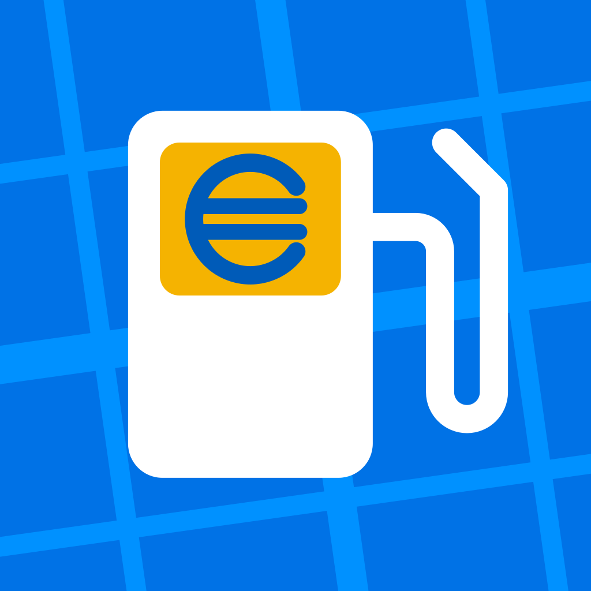

# App Icon — FuelMap

Fuente de verdad del app icon. El PNG del asset catalog se **genera** desde el SVG de
aquí; si hay que retocar el icono, se edita el SVG y se re-rasteriza (no se toca el PNG).

## Elegido

`icon-colonnina-bold.svg` → `FuelMap/Assets.xcassets/AppIcon.appiconset/AppIcon-1024.png`

Surtidor blanco sobre azure (`brandPrimaryFill` #0072E6), display en `cheapestGold`
(#F5B301), € en azure profundo (#005BB8), rejilla de calles en `brand-500` (#0091FF).

**Concepto:** la gasolinera es el héroe; el € no va pegado al lado sino que **es lo que
muestra el display** — la estación te está diciendo el precio. El oro es el color que en
el design system significa "el más barato", así que el ahorro se lee por color, no por
adorno. La rejilla conserva la mitad "Map" del nombre.

**Por qué display oro con € azure y no € oro sobre blanco:** oro sobre blanco da ~1.9:1
de contraste, ilegible. Invertido, el oro gana presencia y el € se lee.

## Dirección de diseño (acordada con el usuario)

Precio/ahorro primero · métafora "encontrar barato cerca" · referencia estética Google Maps
· gasolinera como héroe + € como métafora de ahorro.

## Descartados (no repetir)

| Concepto | Por qué murió |
|---|---|
| **Totem-pin** | El mejor sobre el papel (el totem de precios de carretera *es* un pin). Rasterizado lee como **bocadillo de chat**; estrechar el tablero lo empeoró. Tablero + apéndice inferior siempre lee como callout a escala de icono. |
| **Pompa-pin** | Surtidor terminado en punta de pin: no lee como ubicación, lee como si el surtidor **goteara**. |
| **Pensilina** | El techo de la estación sería la imagen más fiel de "gasolinera", pero techo + dos columnas + € es el icono universal de **banco**. Descartado sin dibujar. |
| **Ribasso (▼)** | Pin con el glifo BASSO calado revelando oro. Técnicamente el más sólido a 40pt; descartado por decisión de producto. |
| **Euro-pin** | Pin + €. Dice precio pero no dice combustible: valdría para cualquier app de precios. Faltaba la gasolinera. |
| **Livello** | Pin como depósito con nivel bajo = precio bajo. Lee como indicador de carga a medias; a 40pt el oro es una astilla. |
| **Costellazione** | Pin oro entre estaciones azules. Funciona a 180pt; a 40pt los puntos son confeti. |
| **Due prezzi** | Dos barras, gana la corta en oro. No dice precio: parece un skeleton loader. |
| **F-pin** | La F de FuelMap en punta de pin. Se afina a 40pt y una F no dice ni precio ni mapa. |
| **Cartellino** | Etiqueta de precio con punta de pin. Azure translúcido sobre oro vira a verde oliva. |

## Herramientas

- `preview.html` + `variants.js` — preview de la skill `opendesign:svg-design`
  (`claude plugin install opendesign@opendata-skills`). Recarga en vivo cada 3s.
  **No editar `preview.html`**: es un scaffold de la skill; los datos van en `variants.js`.
- `squircle-sheet.html` — hoja de contactos propia con la **máscara squircle de iOS** a
  180/120/80/60/40pt. El preview de la skill está pensado para logos (favicon, nav bar)
  y no enmascara, que es justo donde se decide un app icon.

## Re-generar el PNG del asset catalog

```bash
cd .claude/design/appicon
cat > /tmp/_render.html <<'EOF'
<!doctype html><meta charset="utf-8">
<style>html,body{margin:0;padding:0}img{display:block;width:1024px;height:1024px}</style>

EOF
cp /tmp/_render.html ./_render.html
"/Applications/Google Chrome.app/Contents/MacOS/Google Chrome" --headless --disable-gpu \
  --screenshot=/tmp/appicon_raw.png --window-size=1024,1024 --hide-scrollbars _render.html
rm _render.html
python3 -c "
from PIL import Image
im = Image.open('/tmp/appicon_raw.png').convert('RGB')  # sin alfa: requisito de Apple
im.save('../../../FuelMap/Assets.xcassets/AppIcon.appiconset/AppIcon-1024.png','PNG',optimize=True)
"
```

> No hay rasterizador SVG instalado (ni `rsvg-convert`, ni `cairosvg` con libcairo, ni
> ImageMagick); se usa Chrome headless. El `convert("RGB")` **no es opcional**: Apple
> rechaza app icons con canal alfa.
